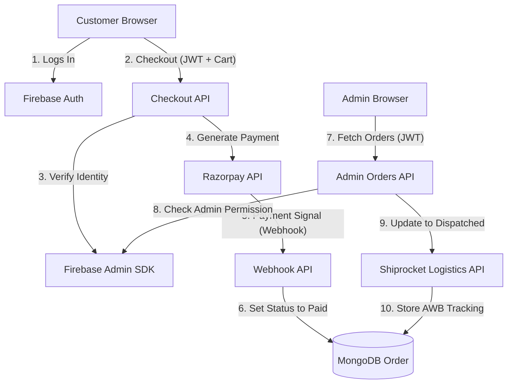

# Technical Blueprint: Handicrafts E-Commerce Core

This document serves as the "Master Context" for AI agents and developers. It details the architecture, folder structure, and the **Internal Connection Logic** of the Handicrafts platform.

---

## 1. Core Architecture & Tech Stack
- **Framework**: Next.js 16.2 (App Router)
- **Database**: MongoDB (Mongoose ODM)
- **Authentication**: Firebase Client SDK (Frontend) + `firebase-admin` (Backend Verification)
- **State Management**: React Context API (`CartContext`, `AuthContext`).

---

## 2. Project Folder Structure
```bash
src/
├── app/                  # Next.js App Router (Pages & API Routes)
│   ├── (admin)/          # Admin Dashboard Layout & Pages (Protected)
│   ├── (store)/          # Public Frontend Storefront (Home, Shop, Product, Cart)
│   ├── api/              # Secure Backend Endpoints
│   │   ├── admin/        # Order Management & Status Update APIs
│   │   ├── checkout/     # Razorpay Order Initiation
│   │   ├── orders/       # Customer-facing Order History & Status Management
│   │   │   ├── [id]/cancel # Secure order cancellation endpoint
│   │   └── webhooks/     # Razorpay Payment Confirmation Listener
├── components/           # Reusable UI Architecture
├── lib/                  # Core Business Logic & External Integrations
│   ├── db.js             # Mongoose MongoDB Connection (Shared Instance)
│   ├── firebase-admin.js # Server-side Auth Verification
│   ├── shiprocket.js     # Shiprocket Delivery Partner Integration Class
├── models/               # MongoDB Data Schema Definitions (Mongoose)
│   ├── Order.js          # Master Transaction & Logistics Document
│   └── Product.js        # Product, Pricing, and Stock Schema
└── store/                # React Context Global State
```

---

## 3. System Connection Logic (How everything talks)

This section explains the **Connectivity Chain** between components:

### A. The Database Connection (`lib/db.js` -> `models/`)
- **Direct Link**: Every API route imports `lib/db.js` to initialize the Mongoose connection.
- **Shared Schemas**: All CRUD operations use the same schemas in `models/`. For example, `api/checkout` reads from `models/Product.js` and writes to `models/Order.js`, while `api/admin/orders` reads from the same `Order.js` collection.
- **Consistency**: This shared bridge ensures that the Admin sees the exact same data the Customer just generated.

### B. The Authentication Bridge (`Frontend` -> `lib/firebase-admin.js`)
- **Frontend ID**: When a user logs in, Firebase provides a **JWT Token**.
- **The Authorization Link**: The frontend sends this token in the `Authorization: Bearer <JWT>` header to any backend API.
- **The Decryption Link**: The backend uses `lib/firebase-admin.js` to decrypt the token. It then checks the resulting email against the `NEXT_PUBLIC_ADMIN_EMAILS` whitelist.
- **Permissions**: This is the *only* way access is granted to sensitive data; no token = no data.

### C. The Payment Connectivity (`api/checkout` <-> `Razorpay` <-> `api/webhooks`)
- **Outbound Link**: When checking out, `api/checkout` initiates a secure request to Razorpay's servers to create an `order_id`.
- **The Return Webhook**: Razorpay does **not** send payment success to the frontend for security reasons. Instead, it "calls back" directly to your `/api/webhooks/razorpay` endpoint.
- **Internal Action**: Once the webhook confirms the payment (via HMAC signature), it modifies the `Order` model status to `Paid`.

### D. The Logistics Connectivity (`Admin Dashboard` -> `Shiprocket API`)
- **Workflow Trigger**: Inside the Admin UI, when the **"Dispatched"** button is clicked, it calls a `PATCH` API.
- **Internal-to-External Link**: That API (`api/admin/orders/[id]/status`) pulls the customer's data from MongoDB and immediately passes it to `lib/shiprocket.js`.
- **The AWB Link**: If the Shiprocket API responds with a successful shipment, the backend instantly updates the **AWB Code** in the original MongoDB order document.

### E. The Customer History Link (`api/orders` -> `models/Order.js`)
- **Secured Retrieval**: Customers fetch their own orders via a `GET` request at `api/orders`. 
- **Identity Lock**: The backend strictly filters the MongoDB query by `customerId` after verifying the Firebase JWT, ensuring nobody can see another user's purchases.
- **Snapshot Integrity**: The UI displays product images, prices, and status specifically from the captured snapshots in the `Order` document, not the live `Product` collection.
- **Cancellation Bridge**: Users can trigger a `PATCH` to `api/orders/[id]/cancel`. This includes a **Logistics Lock**—cancellations are only permitted if the status is `Placed` or `Packed`. Once `Dispatched`, the button is disabled to prevent logistical conflicts.

### F. Checkout UX & Data Integrity
- **Sanitization Layer**: The checkout form includes a **Numeric Masking** layer on Mobile Number and Pincode fields to prevent invalid data entry and ensure downstream compatibility with the Shiprocket API.
- **Image Snapshotting**: During order creation, the system takes a "Snap" of the primary product image URL and stores it inside the order record. This guarantees that if a product is deleted or updated later, the customer's purchase history remains visually accurate.

---

## 4. Visualizing the Entire Flow



---

## 5. Required Environment Variables
```env
MONGODB_URI=            # Bridge to Database
NEXT_PUBLIC_SITE_URL=   # Base URL for Webhooks

NEXT_PUBLIC_FIREBASE_API_KEY=
FIREBASE_SERVICE_ACCOUNT_KEY= # Bridge for Admin Identity

NEXT_PUBLIC_RAZORPAY_KEY_ID=
RAZORPAY_KEY_SECRET=
RAZORPAY_WEBHOOK_SECRET=      # Bridge for Payment Assurance

SHIPROCKET_EMAIL=
SHIPROCKET_PASSWORD=          # Bridge for Delivery Partner
```
